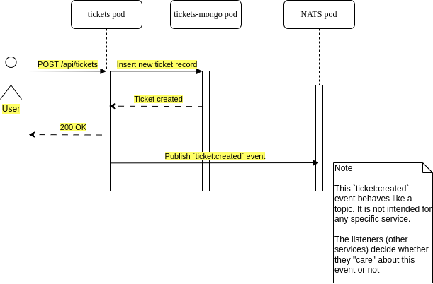

# Event-Driven Microservice

A simple ticketing app consisting of multiple services that communicate via an event bus. Hosted on Google Kubernetes Engine.

## Services

- Client. Frontend UI implemented in NextJS to demonstrate how SSR client works in a Kubernetes pod environment.
- Auth. Simple JWT-based authN & authZ.
- Tickets. Handles CRUD operations related to `tickets` resource.
- Orders. Handles CRUD operations related to `orders` resource.
- Expiration. Countdown to order expiration and sends event to notify other services of order expiration.
- Event bus. Implemented using NATS to exchange events between services.
- Payment. WIP to handle payment and communicate with external service (Stripe).

## Common Module

The `common` directory is published to npm. It defines app-wide events, errors, types (interfaces), and constants to standardize communication between services.

## TO-DO

1. Implement third party OAuth
2. Migrate NATS to RabbitMQ
3. Testing

## Example Sequence / Flow

1. Create new ticket 
   
